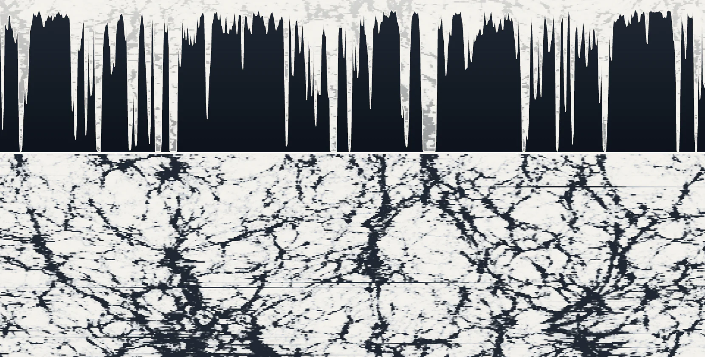
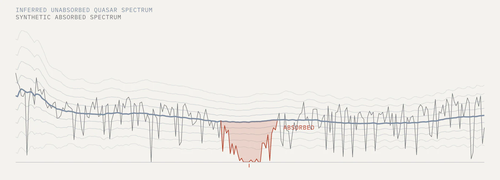
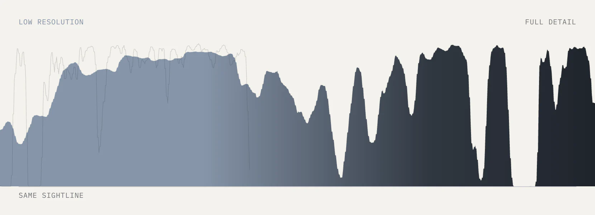
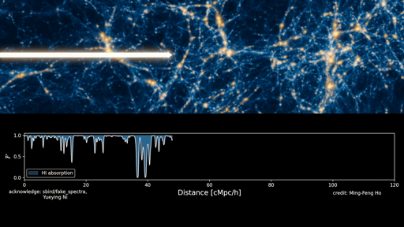
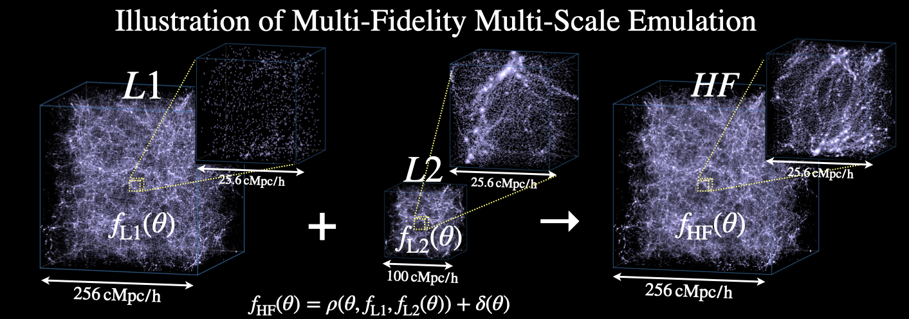
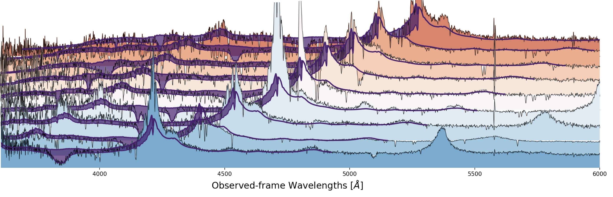

<a href="https://jibancat.github.io">
  <picture>
    <source media="(prefers-color-scheme: dark)" srcset="./img/ink/banner-dark.svg">
    
  </picture>
</a>

<a href="https://jibancat.github.io/#research">research</a> &nbsp;·&nbsp;
<a href="https://jibancat.github.io/#projects">projects</a> &nbsp;·&nbsp;
<a href="https://jibancat.github.io/talks/">talks</a> &nbsp;·&nbsp;
<a href="https://jibancat.github.io/#papers">papers</a> &nbsp;·&nbsp;
<a href="https://jibancat.github.io/cv/">cv</a>

### Hi there, I am Ming-Feng ([Jibancat][website]) 👋

### I'm an astronomer, simulator, and data scientist

- 🔭 I'm a postdoc at the University of Michigan, working on the Lyα forest, dense absorbers, and the inference problems that come with them. Check out my personal website: [jibancat.github.io][website]!
- 🎤 New: my public talk, [*The Lyman-alpha Forest: Reading the Universe and Galaxies in Shadows*][talk], is built as a live web page you can click through.
- 🌱 I’m currently learning psychology and what is Taiwan/Taiwanese!
- 🧋 My past works include a machine learning pipeline for finding DLAs ([gp_dla_finder](https://github.com/jibanCat/gp_dla_finder), now one of the finders behind the DESI DR2 DLA catalogue), multi-fidelity emulators for cosmological simulations ([matter_multi_fidelity_emu](https://github.com/jibanCat/matter_multi_fidelity_emu), [matter_emu_mfbox](https://github.com/jibanCat/matter_emu_mfbox)), and an automated tool for quasar redshift estimation ([gp_qso_redshift](https://github.com/sbird/gp_qso_redshift)).
- 🥅 ~2025 Goals: Learn more about self-supervised learning and find a job~ 2026 Goals: Learn to use Claude and let the agents do works for me (躺平)
- ⚡ Fun fact: I love to play Elden Ring and cello. And before pursuing my astronomy PhD, I loved writing literature and (briefly) worked in the fascinating field of digital humanities!

<picture>
  <source media="(prefers-color-scheme: dark)" srcset="./img/ink/sightline-dark.svg">
  
</picture>

01 · RESEARCH

### From quasar light to small-scale structure

Light from a distant quasar crosses the cosmic web before it reaches us. Diffuse hydrogen along its filaments absorbs that light at different wavelengths, and together those absorption features form the Lyα forest. The forest probes very small scales, and the dense absorbers inside it (DLAs) leave their own mark on the same statistics, so their population enters the cosmological likelihood too.

`light → forest → sightlines → statistics → matter power`

02 · SELECTED WORK

### Small-scale Lyα cosmology with high-resolution spectra
JCAP 2026 · small-scale cosmology

<a href="https://arxiv.org/abs/2509.18271"><picture><source media="(prefers-color-scheme: dark)" srcset="./img/ink/figures/fig-lya-cosmo-dark.webp"></picture></a>

<i>a sightline read from the field · simulated · PRIYA</i>

High-resolution quasar spectra resolve the Lyα forest out to wavenumbers of order k ~ 10 h Mpc⁻¹. Using KODIAQ-SQUAD and XQ-100, we constrain the amplitude and slope of the small-scale matter power spectrum. 
[arXiv:2509.18271](https://arxiv.org/abs/2509.18271) · [JCAP 07 (2026) 094](https://doi.org/10.1088/1475-7516/2026/07/094)

### Finding damped absorbers automatically
2020 → DESI · absorbers · inference

<a href="https://github.com/jibanCat/gp_dla_finder"><picture><source media="(prefers-color-scheme: dark)" srcset="./img/ink/figures/fig-dla-finder-dark.webp"></picture></a>

<i>how it works · synthetic · illustrative</i>

Rather than a yes-or-no detection, the finder keeps a posterior over each absorber's redshift and column density. It is now one of the complementary finders used for the DESI DR2 DLA catalogue. 
[DR12](https://arxiv.org/abs/2003.11036) · [DR16Q](https://arxiv.org/abs/2103.10964) · [DESI DR2](https://arxiv.org/abs/2503.14740) · [code](https://github.com/jibanCat/gp_dla_finder)

### Multi-fidelity emulation
2022 – 2023 · emulation · uncertainty

<a href="https://arxiv.org/abs/2306.03144"><picture><source media="(prefers-color-scheme: dark)" srcset="./img/ink/figures/fig-mf-emu-dark.webp"></picture></a>

<i>one sightline, resolution rising · simulated · PRIYA</i>

High-resolution simulations are expensive, so there are never enough of them. Multi-fidelity emulation combines many low-resolution runs with a few high-resolution ones and learns the correction between them. 
[MF emulator](https://arxiv.org/abs/2105.01081) · [MF-Box](https://arxiv.org/abs/2306.03144) · [forest](https://arxiv.org/abs/2207.06445) · [code](https://github.com/jibanCat/matter_emu_mfbox) · [watch the method ▶](https://www.youtube.com/watch?v=tQIytDnWOzk)

### One population of black holes, or two?
PRD 2024 · population inference

<a href="https://arxiv.org/abs/2408.09024"><picture><source media="(prefers-color-scheme: dark)" srcset="./img/ink/figures/fig-bh-pop-dark.webp"></picture></a>

Hierarchical population inference on GWTC-3: how much could two proposed black-hole populations mix? 
[arXiv:2408.09024](https://arxiv.org/abs/2408.09024) · [PRD 110, 063031](https://doi.org/10.1103/PhysRevD.110.063031)

Full list on <a href="https://jibancat.github.io/#papers">my website</a> and <a href="https://scholar.google.com/citations?user=gF5V0LUAAAAJ&hl=en">Google Scholar</a>.

03 · TALKS

### 🎤 The Lyman-alpha Forest

A 20-minute public talk that reads quasar light through one simulated universe, [built as a live web page][talk] (arrow keys or space to go on; best on a laptop).

- 🎬 Videos: [watch the render](https://www.youtube.com/watch?v=4ccwRtn-NTQ) · [watch the method](https://www.youtube.com/watch?v=tQIytDnWOzk) · [a PRIYA sightline, full resolution](https://youtu.be/xBZLH14Qzyo)

🗂️ older figures (2023)

 

**PRIYA**: a new suite of Lyman-alpha forest simulations for cosmology [(arXiv:2306.05471)](https://arxiv.org/abs/2306.05471), and the companion paper using PRIYA for inference [(arXiv:2309.03943)](https://arxiv.org/abs/2309.03943)

**MF-Box**: multi-fidelity and multi-scale emulation for the matter power spectrum [(arXiv:2306.03144)](https://arxiv.org/abs/2306.03144)

**DLAs** from SDSS DR16Q with Gaussian processes [(arXiv:2103.10964)](https://arxiv.org/abs/2103.10964)

<picture>
  <source media="(prefers-color-scheme: dark)" srcset="./img/ink/sightline-dark.svg">
  
</picture>

### Connect with me:

<a href="https://jibancat.github.io"><picture><source media="(prefers-color-scheme: dark)" srcset="./img/ink/icons/website-dark.svg"></picture></a> <a href="https://jibancat.github.io/cv/"><picture><source media="(prefers-color-scheme: dark)" srcset="./img/ink/icons/cv-dark.svg"></picture></a> <a href="https://scholar.google.com/citations?user=gF5V0LUAAAAJ&hl=en"><picture><source media="(prefers-color-scheme: dark)" srcset="./img/ink/icons/scholar-dark.svg"></picture></a> <a href="https://orcid.org/0000-0002-4457-890X"><picture><source media="(prefers-color-scheme: dark)" srcset="./img/ink/icons/orcid-dark.svg"></picture></a> <a href="mailto:mfho@umich.edu"><picture><source media="(prefers-color-scheme: dark)" srcset="./img/ink/icons/email-dark.svg"></picture></a> <a href="https://www.linkedin.com/in/ming-feng-ho-a20431121"><picture><source media="(prefers-color-scheme: dark)" srcset="./img/ink/icons/linkedin-dark.svg"></picture></a> <a href="https://www.youtube.com/channel/UCTVjf6TgaA5LzXBtXAfAD2A"><picture><source media="(prefers-color-scheme: dark)" srcset="./img/ink/icons/youtube-dark.svg"></picture></a> <a href="https://www.instagram.com/jibancat/"><picture><source media="(prefers-color-scheme: dark)" srcset="./img/ink/icons/instagram-dark.svg"></picture></a> <a href="https://www.researchgate.net/profile/Ming-Feng-Ho"><picture><source media="(prefers-color-scheme: dark)" srcset="./img/ink/icons/researchgate-dark.svg"></picture></a>

Banner and figures are drawn from the PRIYA simulations (<a href="https://arxiv.org/abs/2306.05471">Bird et al. 2023</a>), via the public field on <a href="https://jibancat.github.io">jibancat.github.io</a>, by the scripts in <a href="./tools">tools/</a>.

[website]: https://jibancat.github.io
[talk]: https://jibancat.github.io/talks/lya/
